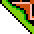

# MarioMaker
MarioMaker combines the merriment of playing super mario and the creativity of players to conjur a game unlike any in a while. It is also a knock-off version of Super Mario Maker.
### MarioMaker Gameplay

### MarioMaker Map Editing

# Rules
- Don't get hit by the bullets or flowers
- hit the flag at the end

# Requirements
Java JDK(Uses entirely *Swing*).

# Controls
### MarioPlayer:
- **arrow keys** to move left and right, up to jump
- **f** for fire balls

### MarioMapEditor:
blocktype | keystroke
----------|----------
left screen roll | left arrow
right screen roll | right left
display block | left-click
erase | 0
 | 1
 | 2
 | 3
 | 4
 | 5
 | 6
 | 7
 | 8
 | 9
 | q
 | w
 | e
 | r
 + | t
 + | y
 | u
 | i
 +  | o
 +  | p
